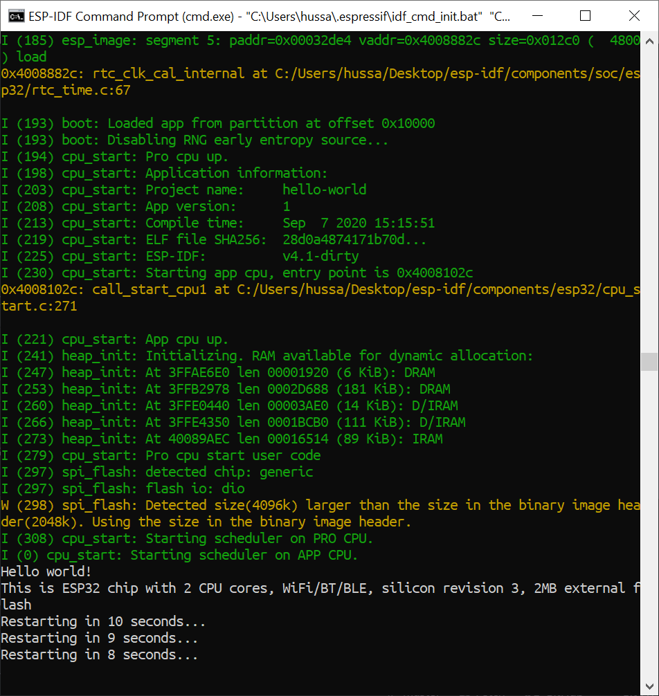
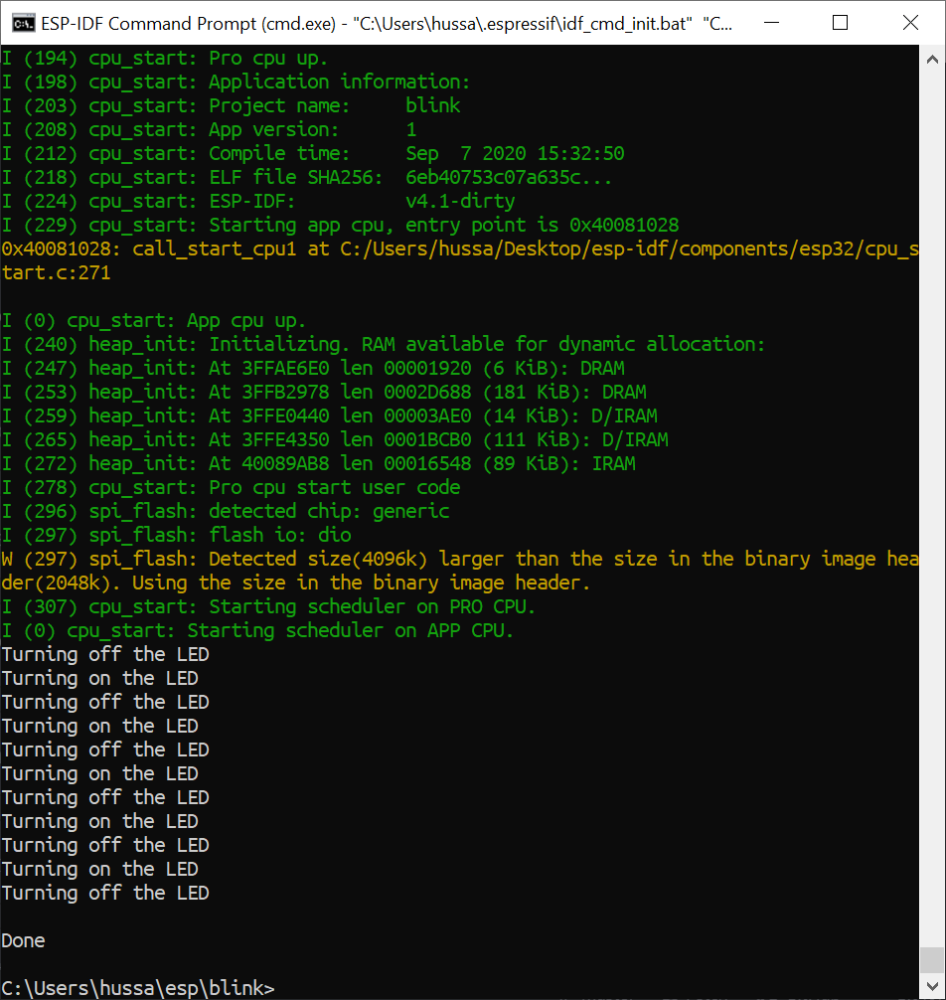

#  Skill 05: Setup Espressif Toolchain

Author: Hussain Valiuddin

Date: 2020-09-07
-----

## Summary
Setting up and running the ESP Toolchain. Uploading the hello world and blink examples to the Huzzah ESP32 and checking for their successful build/flash onto the board using command prompt. Link for images below

## Sketches and Photos

## Modules, Tools, Source Used Including Attribution

## Supporting Artifacts

-----
