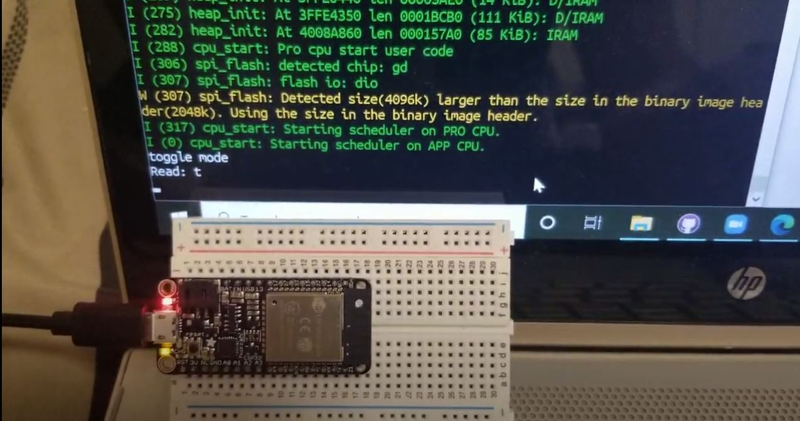

#  Skill 6: Console-IO

Author: Hussain Valiuddin

Date: 2020-9-22
-----

## Summary

Explored communication between the ESP32 and PC. Created a simple program which would cycle through three differentr modes: Toggle mode, echo mode and echo dec to hex mode.
Toggle mode would toggle the onboard LED when a 't' was entered.
Echo mode would display back the input message as is
Echo dec to hex would display back the entered number in hex format.
Implemented shifting between modes when a 's' was entered 

## Sketches and Photos

## Modules, Tools, Source Used Including Attribution

https://github.com/espressif/esp-idf/tree/master/examples/peripherals/uart/uart_echo
https://docs.espressif.com/projects/esp-idf/en/latest/esp32/api-reference/peripherals/uart.html

## Supporting Artifacts

-----
