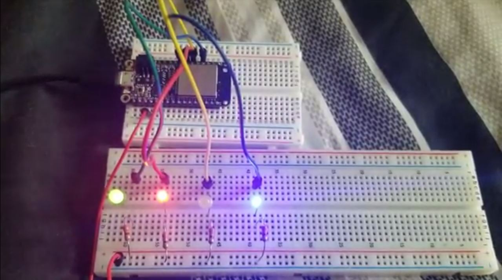

#  Skill 7: Use GPIO to Control LEDs

Author: Hussain Valiuddin

Date: 2020-9-22
-----

## Summary

Created a 4 bit binary counter which would be displayed using LEDs. The binary counter would loop back to zero after reaching 16. LEDs were powered by the GPIO pins on the ESP32. Built on the example code for blink provided in the espressif github page.

## Sketches and Photos

## Modules, Tools, Source Used Including Attribution

https://github.com/espressif/esp-idf/tree/master/examples/get-started/blink
https://github.com/espressif/esp-idf/tree/master/examples/peripherals/uart/uart_echo

## Supporting Artifacts

-----
