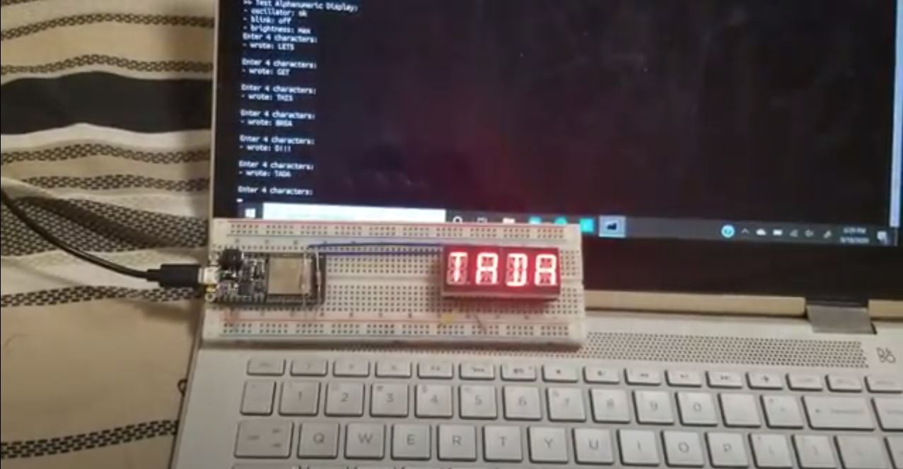

#  Skill 8: Alphanumeric I2C Display

Author: Hussain Valiuddin

Date: 2020-9-22
-----

## Summary

Created a module that gets 4 characters from the console and writes them onto the Adafruit 14-Segment Alphanumeric display. Converted input characters into their Ascii counterparts. Utilized a Bitmap cheatsheet from the Adafruit github repository. Used ascii to reference the characters 16 bit representation for LED display. Communcated with the display using I2C communication.

## Sketches and Photos

## Modules, Tools, Source Used Including Attribution

https://github.com/BU-EC444/code-examples/tree/master/i2c-display
https://github.com/adafruit/Adafruit_LED_Backpack/blob/master/Adafruit_LEDBackpack.cpp
https://learn.adafruit.com/14-segment-alpha-numeric-led-featherwing?view=all

## Supporting Artifacts

-----
