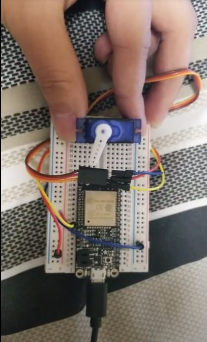

#  Skill 9: Servo

Author: Hussain Valiuddin

Date: 2020-9-22
-----

## Summary

Connected a servo motor successfully with an ESP32. defined the full range of motion for the servo by adjusting min and max frequencies. Used a PWM signal to affect the servos output rotational position. Also tested out results of changing maximum operating range and speed.

## Sketches and Photos

## Modules, Tools, Source Used Including Attribution

https://github.com/espressif/esp-idf/tree/master/examples/peripherals/mcpwm/mcpwm_servo_control

## Supporting Artifacts

-----
