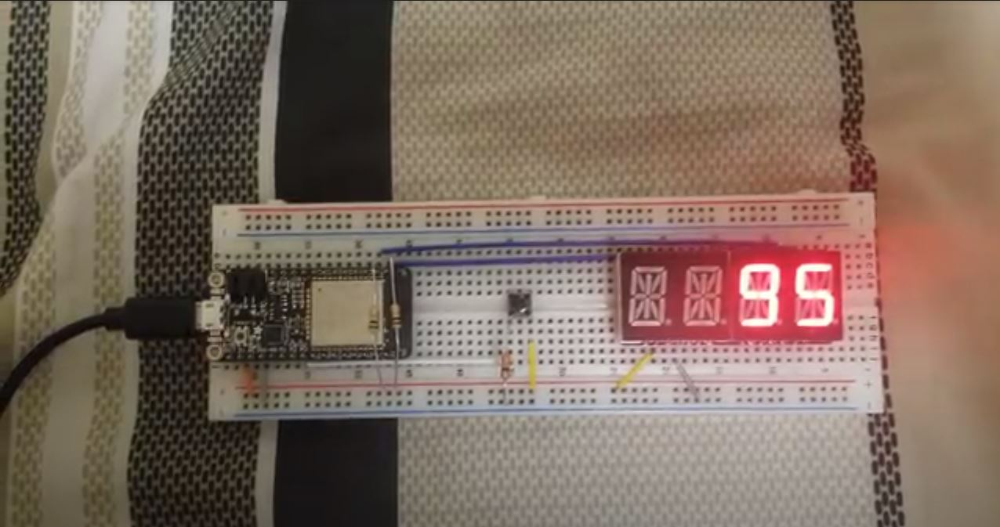

#  Skill 10: RTOS - Hardware interrupt

Author: Hussain Valiuddin

Date: 2020-9-22
-----

## Summary

Used features of a real time OS to run 3 different task simulataneously on the EPS32 board. The three tasks were a Binary LED counter, a display showing the direction of counter and a button to change counting direction. The three tasks were created to run simultaneously without any one process holding back the others. Global variables were used for communication between the tasks.

## Sketches and Photos

## Modules, Tools, Source Used Including Attribution

https://www.freertos.org/a00125.html // xTaskCreate

## Supporting Artifacts

-----
