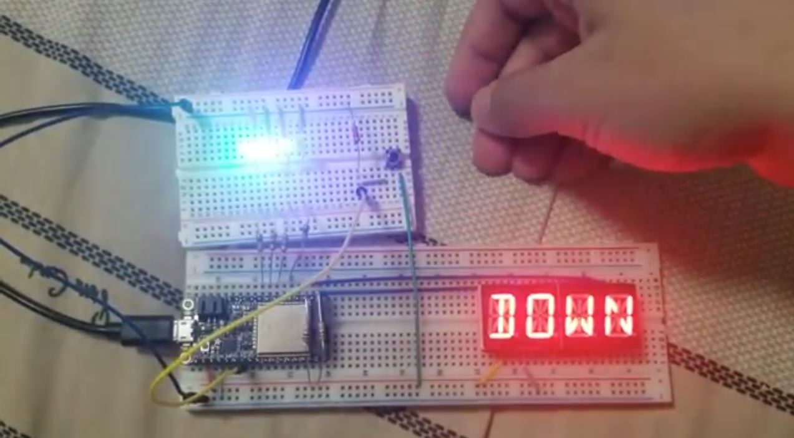

#  Skill 11: Stopwatch

Author: Hussain Valiuddin

Date: 2020-9-22
-----

## Summary

Created a stopwatch which would start at the press of a button and then count up to 99. On future button presses, the counter resets to zero. An Alphanumeric display is used to display the counter. The stopwatch would also focus on using timer interrupts to update the count rather than using delays in tasks for a much more fine tuned clock.

## Sketches and Photos

## Modules, Tools, Source Used Including Attribution

https://github.com/BU-EC444/code-examples/tree/master/i2c-display
https://github.com/adafruit/Adafruit_LED_Backpack/blob/master/Adafruit_LEDBackpack.cpp
https://github.com/espressif/esp-idf/tree/17ac4ba/examples/peripherals/timer_group

## Supporting Artifacts

-----
