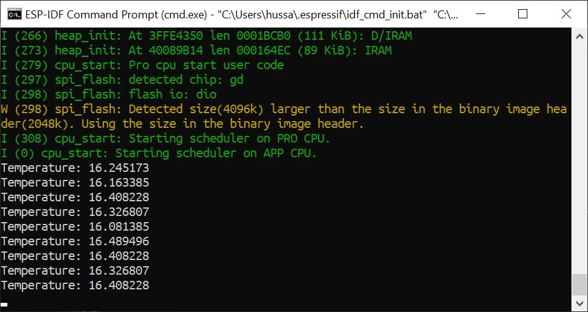

# Skill Name

Author: Hussain Valiuddin
Date: 2020-10-08

---

## Summary

In this skill, the A2 ADC pin on the ESP reads the voltage at that point. We use a voltage divider method using the thermistor as R1 and a 1Kohms resistor for R2. The 1Kohm resistor was used to make sure that the voltage at the pin would never go above 3V within the temperature range from -10 Celcius to 110 Celcius. Using the voltage at the ADC pin, we calculate the resistance of the thermistor. Then using that resistance, we calculate the temperature which causes the thermistor to be at that resistance.

## Sketches and Photos

## Modules, Tools, Source Used Including Attribution

https://github.com/espressif/esp-idf/tree/39f090a4f1dee4e325f8109d880bf3627034d839/examples/peripherals/adc

## Supporting Artifacts

https://www.jameco.com/Jameco/workshop/techtip/temperature-measurement-ntc-thermistors.html

---
