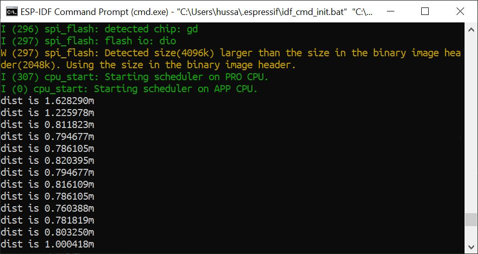

# Skill Name

Author: Hussain Valiuddin
Date: 2020-10-08

---

## Summary

In this skill, the A2 ADC pin on the ESP reads the voltage at that point. We read the voltage at that point and using the conversion formula provided by the datasheet, the code calculates the distance of the object from the sensor. Some calibration is carried out to make the reading s more accurate.

## Sketches and Photos

## Modules, Tools, Source Used Including Attribution

https://github.com/espressif/esp-idf/tree/39f090a4f1dee4e325f8109d880bf3627034d839/examples/peripherals/adc

## Supporting Artifacts

https://www.maxbotix.com/documents/HRLV-MaxSonar-EZ_Datasheet.pdf

---
