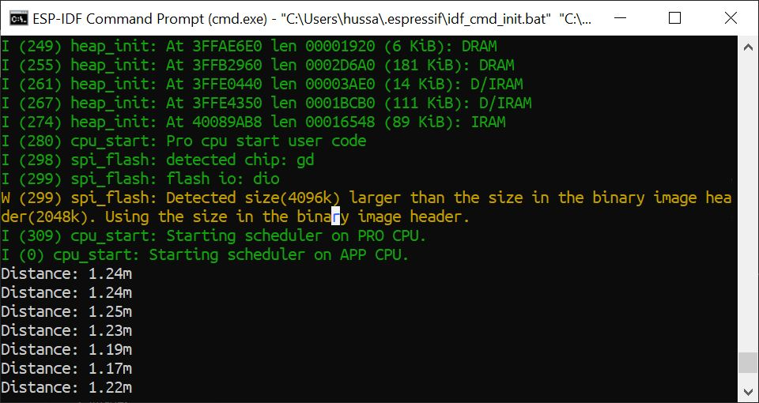
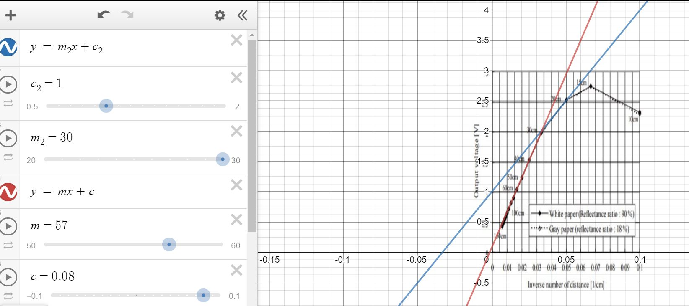
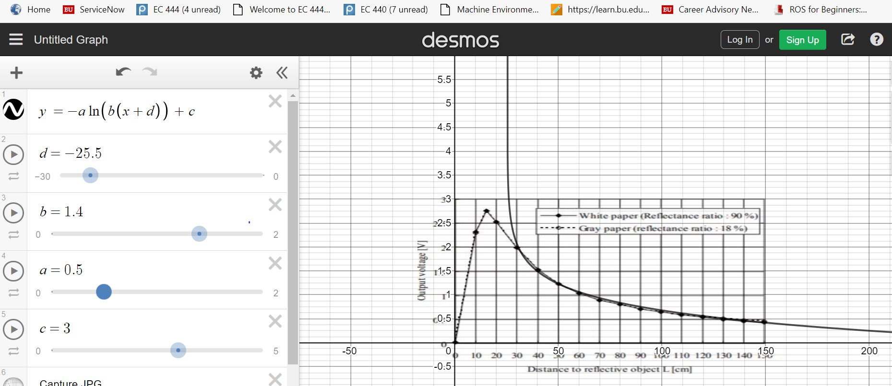

# Skill Name

Author: Hussain Valiuddin
Date: 2020-10-08

---

## Summary

In this skill, the A2 ADC pin on the ESP reads the voltage at that point. We read the voltage and using the conversion formula (calculated by finding the line of best fit to the voltage vs distance and voltage vs 1/distance graphs provided in the datasheet), the code calculates the distance of the object from the sensor. For longer distances, the code uses the logarithmic line of best fit to get more accurate values. The results are then printed to the console.

## Sketches and Photos

## Modules, Tools, Source Used Including Attribution

https://github.com/espressif/esp-idf/tree/39f090a4f1dee4e325f8109d880bf3627034d839/examples/peripherals/adc

## Supporting Artifacts

https://www.sparkfun.com/datasheets/Sensors/Infrared/gp2y0a02yk_e.pdf
https://docs.espressif.com/projects/esp-idf/en/latest/esp32/api-reference/peripherals/adc.html

---
