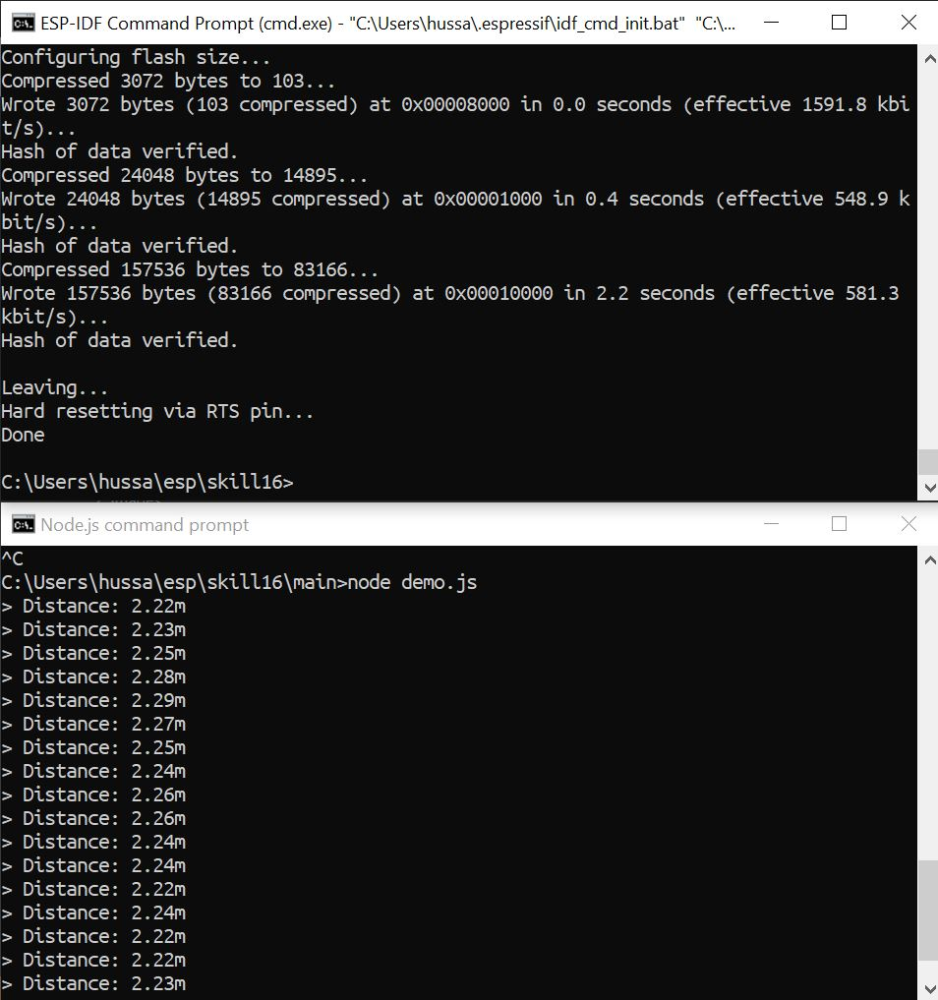

# Skill Name

Author: Hussain Valiuddin
Date: 2020-10-08

---

## Summary

This skill utilizes the code from the previous skill15 and instead of using flash monitor to dislay the results onto the console, in this skill, we use a javascript file to read the values from the serialport and display them to console. We also install Node.js to be able to run the javascript file.

## Sketches and Photos

## Modules, Tools, Source Used Including Attribution

https://serialport.io/

## Supporting Artifacts

https://www.npmjs.com/package/serialport

---
