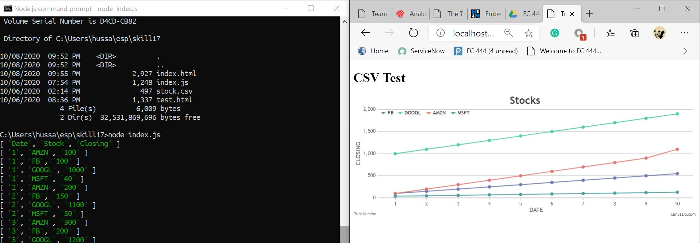

# Skill Name

Author: Hussain Valiuddin
Date: 2020-10-08

---

## Summary

In this skill, we read data from the stock.csv file using the index.js script. The code parses through the .csv and stores the data into 4 different arrays. The these arrays are rendered onto local server and can be accessed through the browser by typing "http://localhost:8080/". index.js uses CanvasJs to plot the graph.

## Sketches and Photos

## Modules, Tools, Source Used Including Attribution

## Supporting Artifacts

https://canvasjs.com/docs/charts/how-to/create-charts-from-csv/
https://canvasjs.com/javascript-charts/multi-series-line-chart/

---
