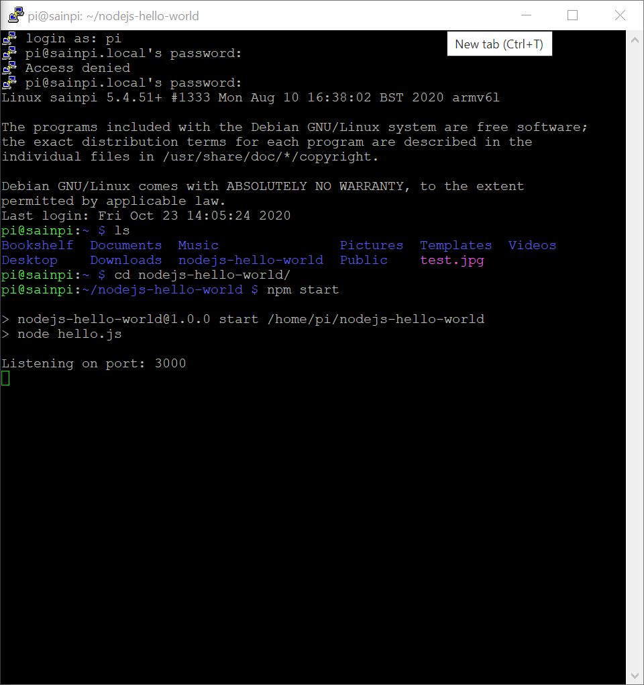
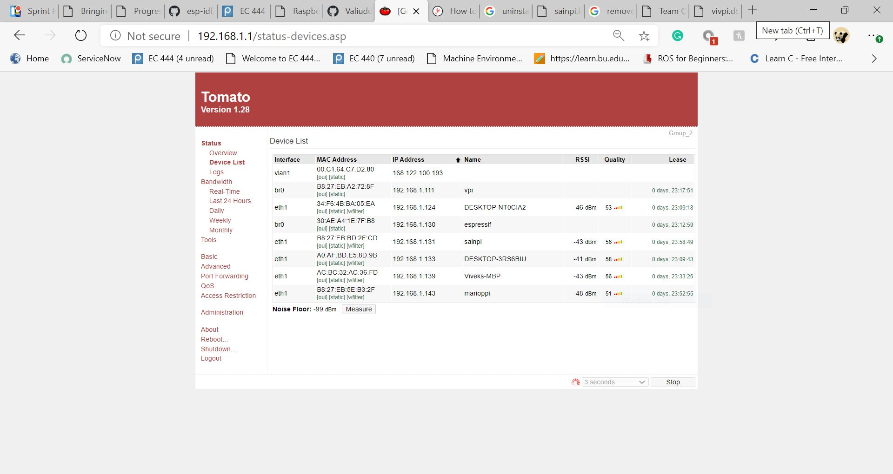

# Skill Name

Author: Hussain Valiuddin
Date: 2020-10-08

---

## Summary

Was not able to complete this skill due to the lack of a SD card reader. Will work on this skill next week.

Update:
Pi has been connected to the internet and a nodejs server was run on the Pi. The "Hello World" server can be viewed through the browser

## Sketches and Photos

## Modules, Tools, Source Used Including Attribution

## Supporting Artifacts
https://desertbot.io/blog/nodejs-git-and-pm2-headless-raspberry-pi-install
https://learn.adafruit.com/raspberry-pi-zero-creation

---
