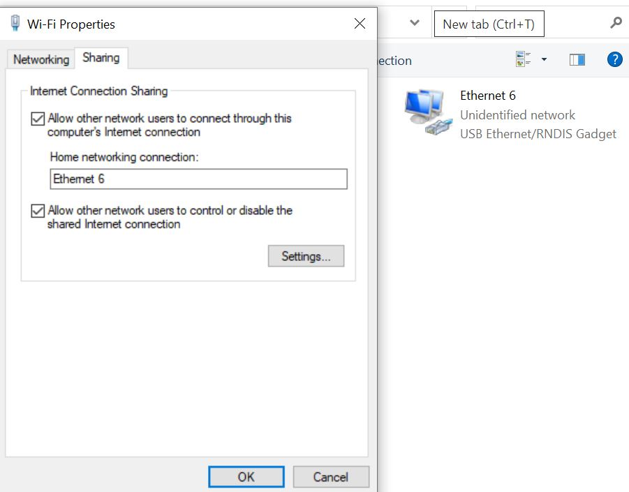

# Pi as WiFi AP

Author: Hussain Valiuddin
Date: 2020-10-23

---

## Summary

Because of the use of a router, we did not set up the pi as a wireless access point. We did however enable Ethernet network sharing to be able to work on the Pi using BU wifi when the router was not available.

## Sketches and Photos

## Modules, Tools, Source Used Including Attribution

http://www.polarcloud.com/tomato

## Supporting Artifacts

https://learn.adafruit.com/turning-your-raspberry-pi-zero-into-a-usb-gadget/ethernet-gadget

https://www.circuitbasics.com/raspberry-pi-zero-ethernet-gadget/

---
