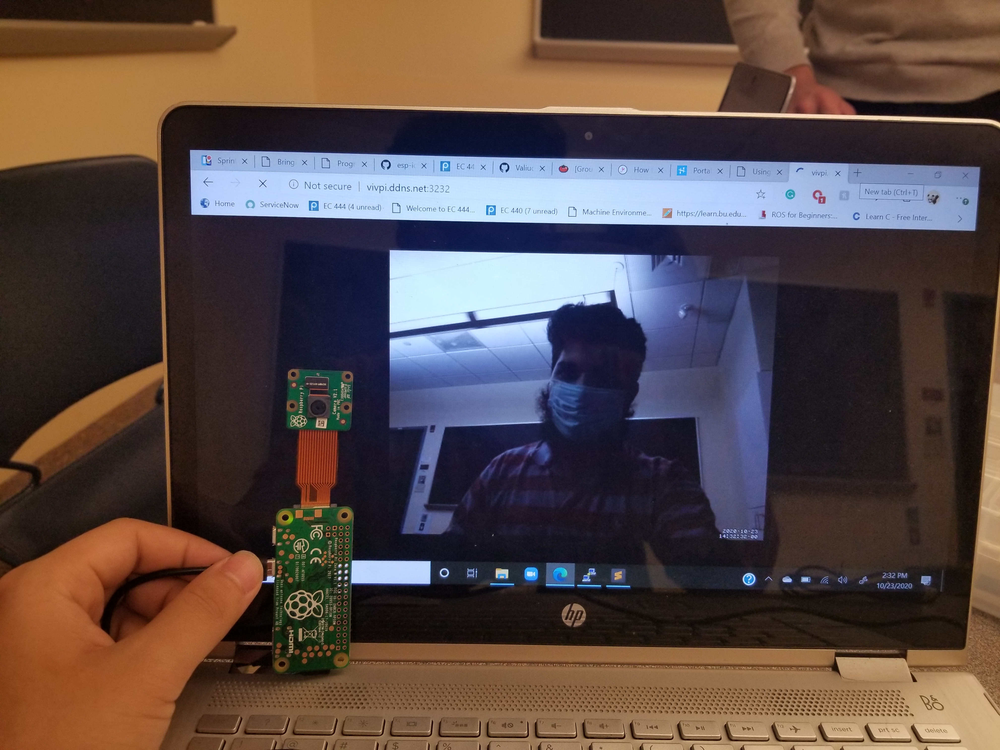

# Pi Web Cam

Author: Hussain Valiuddin
Date: 2020-10-23

---

## Summary

In this skill, the Adafruit product no. 3170 Camera Board v2 is connected to the Pi Zero W. The Rasbberrypi camera setup is used to capture images using this camera.

Later the tutorial from Hackster.io is used to stream video from the camera onto a web server. The server runs locally on port 8081 but by portforwarding, the webcam stream can be viewed from anywhere by using the vivpi.ddns.net:3232 site as desplayed in the image. The current configuration shows significant lag with slow framerate but it works.

## Sketches and Photos

## Modules, Tools, Source Used Including Attribution

## Supporting Artifacts

https://www.hackster.io/narender-singh/portable-video-streaming-camera-with-raspberry-pi-zero-w-dc22fd

https://www.raspberrypi.org/documentation/configuration/camera.md

---
