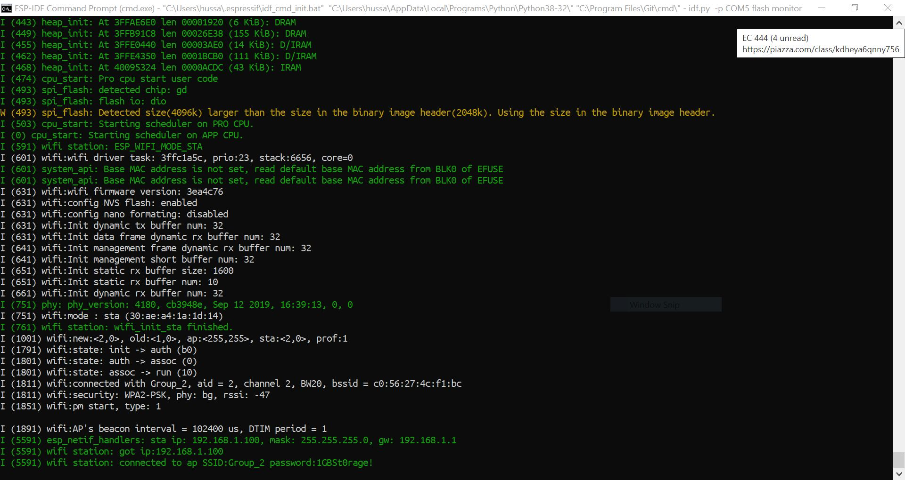
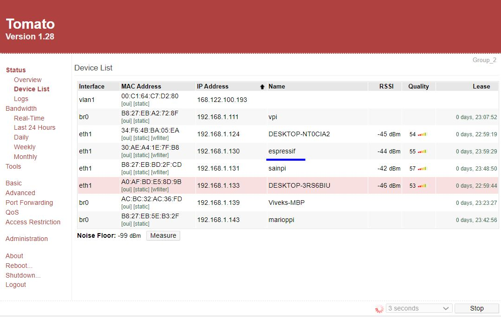

# Wifi-ESP

Author: Hussain Valiuddin
Date: 2020-10-23

---

## Summary

In this skill, we connect the esp to the internet and through the router web portal, we can see that it is connected to the internet

## Sketches and Photos

## Modules, Tools, Source Used Including Attribution

https://github.com/espressif/esp-idf/tree/master/examples/wifi/getting_started/station

## Supporting Artifacts

---
