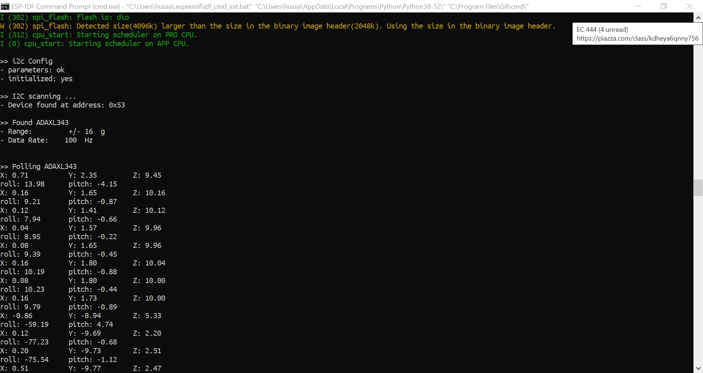
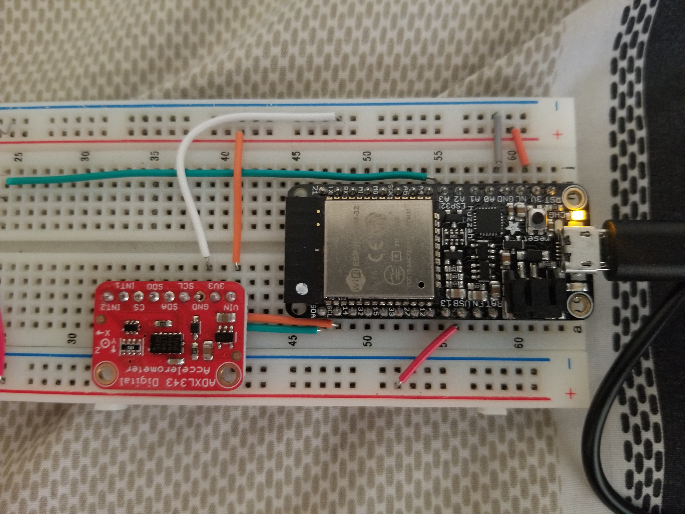
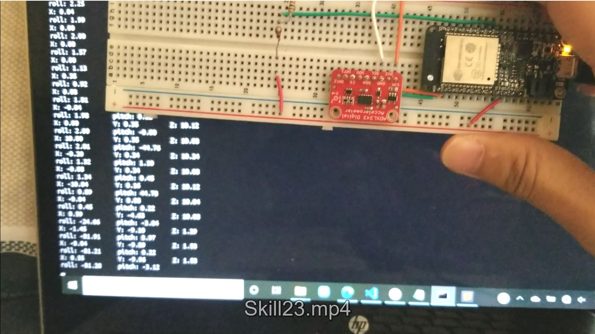

# Accelerometer

Author: Hussain Valiuddin
Date: 2020-10-23

---

## Summary

In this skill, we connect a accelerometer to the ESP32. The ESP32 reads the data from the accelerometer using I2C communication. 4 functions are created. writeRegister to write data to registers. readRegister ti read a byte from data at register address. read16 to read 2 bytes from data at registers and getAccel which provides reg addresses to all X, Y and Z values. The data is read from the registers and converted into X Y and Z axis acceleration using the conversions provided by the accelerometer code. The values for pitch and roll are also calculated using the formulas provided in the datasheet. These values are then printed to console.

## Sketches and Photos

## Modules, Tools, Source Used Including Attribution

https://github.com/BU-EC444/code-examples/tree/master/i2c-accel

https://github.com/adafruit/Adafruit_ADXL343

## Supporting Artifacts

https://cdn-learn.adafruit.com/assets/assets/000/070/556/original/adxl343.pdf?1549287964
https://learn.adafruit.com/adxl343-breakout-learning-guide/overview
https://learn.sparkfun.com/tutorials/i2c

---
