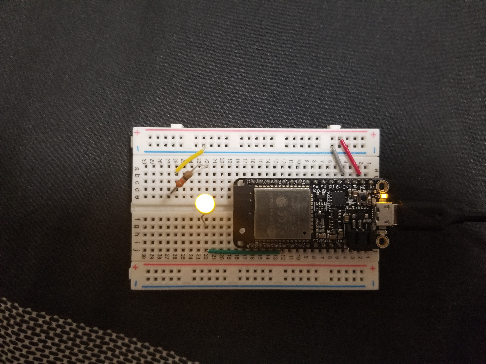

# Using PWN to Control Power to an LED

Author: Hussain Valiuddin
Date: 2020-10-23

---

## Summary

In this skill, we use PWM to increase and decrease the brightness of an LED.

## Sketches and Photos

## Modules, Tools, Source Used Including Attribution

https://github.com/espressif/esp-idf/tree/master/examples/peripherals/ledc

## Supporting Artifacts

https://docs.espressif.com/projects/esp-idf/en/latest/esp32/api-reference/peripherals/ledc.html

---
