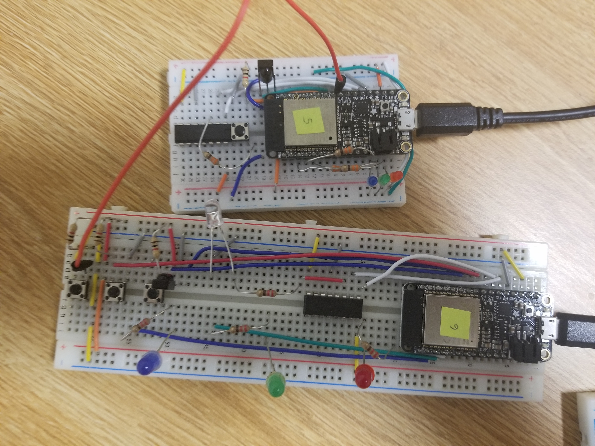

# IR TX/RX

Author: Hussain Valiuddin

## Date: 2020-11-13

## Summary

In this skill we send and receive data using an IR transmitter and an IR receiver. The skill is built on the IR_traffic_light example github code that was given.

In this skill, an ESPs color, which is indicated via LEDs, keeps changing by pressing a button. The button works with a queue therefore it remembers how many times a button was pressed, even if it takes some time to cycle through the changes. The same button also transmits the ESPs color through the IR sensor (A second button for transferring data was introduced for the Quest). If any IR receiver picks up the signal, it changes the color of the receiving ESP to the same color that it received through IR communication.

## Sketches and Photos

Wiring of the ESPs

## Modules, Tools, Source Used Including Attribution

[Traffic Light IR example](https://github.com/BU-EC444/code-examples/tree/master/traffic-light-ir-example)

## Supporting Artifacts

[Link to video demo](https://drive.google.com/file/d/1xcVcPLyx2qDwk3680Neh_l9F0XCXmL69/view?usp=sharing)

---
