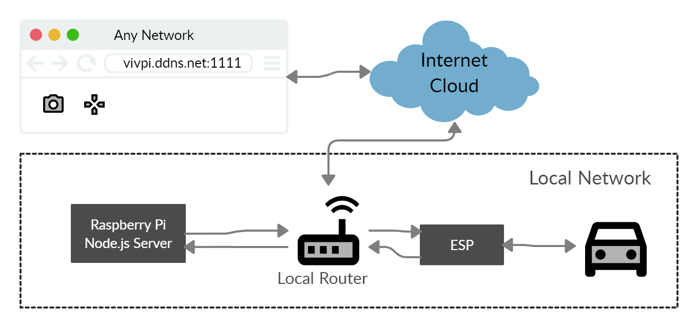

# Security Issues

Author: Hussain Valiuddin

## Date: 2020-11-13

## Summary

In this skill we we discuss security issues with current implementations on code and data communication.

The dateflow of the system is attached below. There are multipel points of weaknesses in this system.

Attackers can attack any of the communication channels being used between these devices. Attackers can send false data to the UDP servers leading to taking control of the car. If the car is controlled though a browser, then getting access to the browser session can also help gain control of the car. Data being sent over the internet could be listened to which would reduece privacy.

5 ways bad guys can attack the system:

1. Gain access to the browser ot control the car
2. Send udp packets to the ESP on the car
3. Intercept response from the car's ESP and not letting it through to the destination device
4. Listening in on the node.js server for data
5. block connection over the net to lose control of the car

Ways to overcome the attacks:

- More secure methods of communication rather than UDP
- Using Encryption on all messages being sent
- Password protection on the web browser
- Lock and key for UDP packets so that packets from unknown sources is not read
- Making most communication local so that less data being sent over the internet

## Sketches and Photos

Dataflow of system

## Modules, Tools, Source Used Including Attribution

## Supporting Artifacts

---
