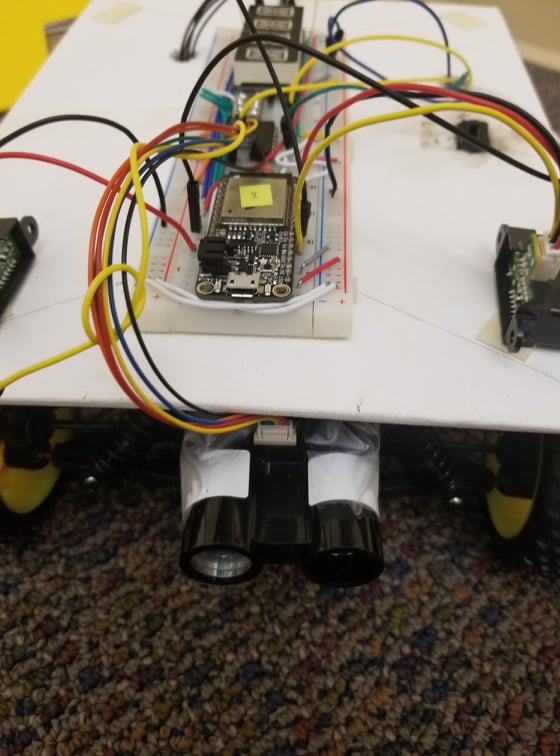

# Skill Name : LIDAR

Author: Hussain Valiuddin

## Date: 2020-12-01

## Summary

In this skill we connect a LIDAR to the esp to caluclate distance. Communication with the LIDAR happens over the I2C using SCL and SDA pins. The LIDAR returns the distance over 2 bytes. The LIDAR has an address of 0x62 where it can be found. The code is similar to the accelerometer and the esp reads both of these bytes by creating an I2C link with the LIDAR, concatenates them and gets the final distance value. To get a more accurate value, 10 values of the LIDAR are read and averaged out over a second.

## Sketches and Photos

## Modules, Tools, Source Used Including Attribution

## Supporting Artifacts

---
