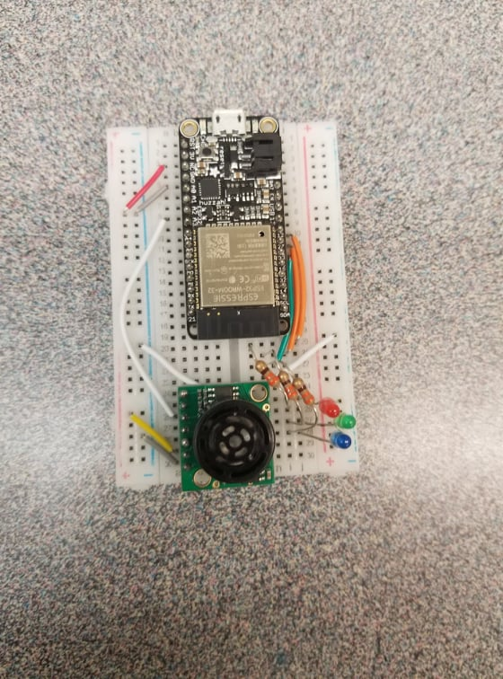

# Skill Name: PID

Author: Hussain Valiuddin

## Date: 2020-12-01

## Summary

Used PID design code on whizzer. Copied the ultrasonic code from the previous quest into the PID and used the distance calculated to detect errors.
The setpoint was set at 50cm. based on measured distance the error was calculated. If the error was positive, it would turn blue, if negative then red else green. This error can then be used to actuate some device like wheels to make it so that the error is reduced.

## Sketches and Photos

## Modules, Tools, Source Used Including Attribution

## Supporting Artifacts

---
